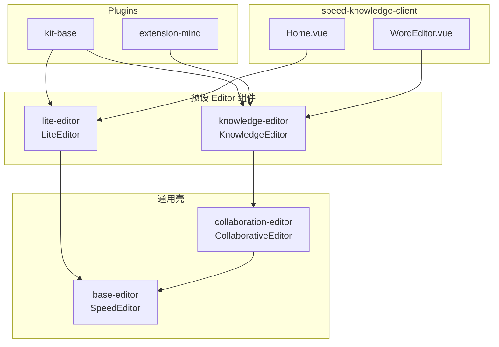

# speed-tiptap-editor Monorepo 架构（v2 草案）

> 基于现有单体 `speed-tiptap-editor` 的重构方案。  
> **Git 仓库名保持不变**；npm scope：**`@speed-tiptap-editor/*`**。

---

## 0. 四类 Editor 包：两层壳 + 两层预设

**凡是以 `-editor` 结尾的包，都是可直接 `<XxxEditor />` 使用的 Vue 组件**，不是只 export 配置的工厂函数。

| npm 包 | **类型** | 导出什么 | 依赖 | 扩展 |
|--------|----------|----------|------|------|
| **`base-editor`** | **通用壳** | `SpeedEditor` | — | ❌ 无业务扩展，由调用方传 `plugins` |
| **`collaboration-editor`** | **协同壳** | `CollaborativeEditor` | `base-editor` | ❌ 同上，只加 yjs / provider |
| **`lite-editor`** | **首页预设** | `LiteEditor` | `base-editor` | ✅ 内置 kit-base + 精简 toolbar |
| **`knowledge-editor`** | **文档预设** | `KnowledgeEditor` | `collaboration-editor` | ✅ 内置 kit-base + title + 文档能力 |

**不是四套独立编辑器实现。** 底层只有 **一套** `SpeedEditor.vue`（在 `base-editor`）；其余都是薄包装或预设封装。

```
                    ┌── LiteEditor（首页，无协同）
lite-editor ────────┤
                    └── 内部 → SpeedEditor

                         ┌── 预览：内部 → SpeedEditor
knowledge-editor ────────┤
                         └── 编辑：内部 → CollaborativeEditor → SpeedEditor
```

**宿主默认用法**：直接 import 预设组件，不必自己拼 `createXxxOptions()`。

需要完全自定义扩展时，才直接用 **`SpeedEditor`** 或 **`CollaborativeEditor`**，自行传入 `plugins` / `toolbar` 等。

**以前文档里的 `vue` 已废弃**——改为 **`base-editor`**（基础编辑器壳）。

---

## 1. 设计目标

| 目标 | 说明 |
|------|------|
| 按需加载 | 首页 lite 不携带 mind / flow / yjs / mammoth 等重型依赖 |
| 前后端共用 schema | nestjs `TiptapTransformer`、`generateJSON` / `generateHTML` 与线上一致 |
| 插件化 UI | toolbar / bubble / insert / modal 跟 extension 走，editor 壳只负责注册表 |
| 协同隔离 | 协同不仅是 extension，单独 `CollaborativeEditor` + `collaboration-editor` 包 |
| 业务域拆分 | 按 lite / knowledge / extension-* 拆，**不**照搬 speed-sheet 的 core/view/react 技术分层 |

### 与 speed-sheet 的差异

| | speed-sheet | speed-tiptap-editor |
|---|-------------|---------------------|
| 内核 | 自研 `@speed-sheet/core` | **Tiptap**（外部依赖） |
| 拆分维度 | 技术层 + extension | **业务场景 + 可选能力包** |
| 对外入口 | `@speed-sheet/vue3-antd` | `LiteEditor` / `KnowledgeEditor`（预设）；高级场景用 `SpeedEditor` / `CollaborativeEditor` |

---

## 2. 仓库与命名

```
Git 仓库:     speed-tiptap-editor          （不改名）
Monorepo 根:  speed-tiptap-editor          private: true
npm scope:    @speed-tiptap-editor/*
旧包兼容:     speed-tiptap-editor@1.x      可 deprecate 或 re-export 至新 scope
```

### 命名约定

- **Editor 包**（含预设）：一律 `-editor` 后缀，且 **必须 export 可用的 Vue 组件**
- **非 UI 基础包**：不加 `-editor` → `shared`、`schema`、`kit-base`、`ui`、`extension-mind`
- **禁止** `packages/core` 或整包复制 `src/`——只按职责拆分到 `ui` / `kit-base` / `base-editor` 等
- scope 已是 `@speed-tiptap-editor`，子包用 `base-editor` 不会变成 `editor/editor` 这种重复

---

## 3. 包结构总览

```
speed-tiptap-editor/
├── package.json
├── pnpm-workspace.yaml
├── turbo.json
├── ARCHITECTURE.md
│
├── packages/
│   ├── shared/                      # @speed-tiptap-editor/shared
│   ├── schema/                      # @speed-tiptap-editor/schema
│   ├── composables/                 # @speed-tiptap-editor/composables
│   ├── document-io/                 # @speed-tiptap-editor/document-io
│   │
│   ├── kit-base/                    # @speed-tiptap-editor/kit-base
│   ├── ui/                          # @speed-tiptap-editor/ui（编辑器专用组件，非整包 src）
│   ├── extensions/
│   │   ├── extension-mind/
│   │   ├── extension-flow/
│   │   ├── extension-import-export/
│   │   └── …
│   │
│   ├── base-editor/                 # 【壳】SpeedEditor，无内置扩展
│   ├── collaboration-editor/        # 【壳】CollaborativeEditor + 协同
│   ├── lite-editor/                 # 【预设】LiteEditor → base-editor
│   └── knowledge-editor/            # 【预设】KnowledgeEditor → collaboration-editor
│
├── demos/vue3-demo/
└── docs/
```

---

## 4. 依赖方向（防循环）

```
shared
  ↑
schema ─────────────────────────→ nestjs、document-io
  ↑
composables
  ↑
kit-base / extension-*
  ↑
base-editor（空壳，只吃 plugins[]）
  ↑
  ├── collaboration-editor（空壳 + 协同，仍只吃 plugins[]）
  │       ↑
  │   knowledge-editor（文档预设，内置扩展，内部选 SpeedEditor / CollaborativeEditor）
  │
  └── lite-editor（首页预设，内置扩展，内部用 SpeedEditor）
```

**禁止：**

- `extension-*` → `base-editor` / `collaboration-editor`（扩展只被预设包或宿主组装）
- `base-editor` / `collaboration-editor` → 具体 `extension-mind` 等（壳只接收 `plugins` 参数）
- `shared` / `schema` → 任何 `-editor` 包
- `schema` → `composables`

---

## 5. 各包职责

### 5.1 `@speed-tiptap-editor/shared`

纯公共、尽量无 Vue。

```
types/          EditorPreset、ToolBarConfig、UploadConfig…
constants/      EXTENSION_PRIORITY_LOWER、节点 type 名
prose-utils/
helpers/
```

---

### 5.2 `@speed-tiptap-editor/schema`

文档 JSON 合同（无 UI）。前后端 + IO 共用。

```
kits/
  lite.ts           首页存库
  knowledge.ts      全量 / 协同 / toYdoc
  import.ts           Word 导入子集
  export.ts           导出
```

---

### 5.3 `@speed-tiptap-editor/composables`

`useFloatingPopup`、`useClickOutside`、`useActive` 等。  
**不放** `useCollaboration`（在 collaboration-editor）、`useSpeedEditorContext`（在 base-editor）。

---

### 5.4 `@speed-tiptap-editor/document-io`

`wordToJson` / `jsonToDocx` 等，依赖 schema kits。

---

### 5.5 `@speed-tiptap-editor/ui` — 【编辑器 UI 壳 + 共享控件】

**不放业务 toolbar 大 map**，只放「壳」和多插件共用的控件。

| 类型 | 放 ui | 放 kit-base / extension-* |
|------|-------|---------------------------|
| MenuBarShell / BubbleMenuBarShell / InsertMenuShell | ✅ 按 registry 渲染 | ❌ |
| ColorPicker、EmojiPicker、SpeedTooltip、dragHandle | ✅ 共享控件 | ❌ |
| Bold / Import / Table 等按钮 | ❌ | ✅ `plugin.toolbar` |
| Text / Image 等气泡菜单 | ❌ | ✅ `plugin.bubbleMenus` |
| Insert 子项 | ❌ | ✅ `plugin.insertItems` |

**Toolbar 与 Bubble 对称**：组件随 plugin 注册；`ui` 只提供壳；preset 只提供 key 顺序。

```
plugin.toolbar: { bold: BoldButton }
plugin.bubbleMenus: { text: [TextMenu] }
         ↓ mergePluginRegistries()
MenuBarShell(buttons, toolbarKeys)   BubbleMenuBarShell(registry, bubbleMenus)
```

**base-editor 自定义**：传 `plugins` + `toolbarKeys`；或 `#menubar` slot / 自定义 MenuBar 组件。

**不迁入 ui 的平台遗留**：`docItem`、`wikiItem`、`document/editor` 等。

`ui` 依赖 `shared` + `composables`；`base-editor` 依赖 `ui`（迁移完成后接入壳，替换 `@st/menus` 静态 map）。

---

### 5.5.1 Toolbar / Bubble / Insert 分工（补全）

| 配置层 | 谁提供 | 内容 |
|--------|--------|------|
| **组件** | `SpeedEditorPlugin` | `toolbar`、`bubbleMenus`、`insertItems` |
| **布局** | preset / 宿主 | `toolbarKeys`（含 `\|`）、`bubbleMenus` key 列表 |
| **渲染** | `ui` 壳 | `MenuBarShell`、`BubbleMenuBarShell`、`InsertMenuShell` |
| **预设** | lite/knowledge-editor | 组装 plugins + 默认 layout，**不拥有** menus 源码目录 |

---

### 5.6 `@speed-tiptap-editor/kit-base`

基础 **SpeedEditorPlugin** 合集（table、image、emoji… + 对应 bubble/toolbar UI）。

---

### 5.7 `@speed-tiptap-editor/extension-*`

可选重型能力（mind、flow、import-export…），各自 peer 大库。

---

### 5.8 Plugin 契约

```ts
interface SpeedEditorPlugin {
  name: string
  extensions: Extension[] | ((ctx) => Extension[])
  toolbar?: Record<string, Component>
  bubbleMenus?: Partial<Record<BubbleMenuKey, Component[]>>
  insertItems?: InsertMenuItem[]
  overlays?: Component[]
  hooks?: EditorPluginHooks
}
```

---

### 5.9 `@speed-tiptap-editor/base-editor` — 【通用壳】

**无内置业务扩展**，适合完全自定义场景。

```
SpeedEditor.vue
MenuBar.tsx / BubbleMenuBar.tsx    plugin 注册表渲染
useSpeedEditorProvider
```

```vue
<SpeedEditor
  :plugins="myPlugins"
  :toolbar-keys="myToolbar"
  :bubble-menus="myBubbleMenus"
  :features="myFeatures"
  :editable="..."
  :content="..."
/>
```

无 `ydoc` / `provider`，无 yjs runtime import。

---

### 5.10 `@speed-tiptap-editor/collaboration-editor` — 【协同壳】

**无内置业务扩展**，在 `SpeedEditor` 外包一层协同；适合「我要协同 + 自己拼插件」。

```
CollaborativeEditor.vue
useCollaboration.ts
collabPlugin.ts
```

```vue
<CollaborativeEditor
  :plugins="myPlugins"
  :toolbar-keys="myToolbar"
  :collaboration-config="{ documentId, url, token, user }"
  :editable="true"
/>
```

---

### 5.11 `@speed-tiptap-editor/lite-editor` — 【首页预设组件】

**依赖 `base-editor`**，扩展与 toolbar 已内置，宿主开箱即用。

```
LiteEditor.vue          内部 assemble plugins + 渲染 SpeedEditor
createLiteEditorPlugins()   （可选 advanced export，供二次封装）
```

```vue
<LiteEditor
  :editable="isEditing"
  :content="html"
  placeholder="写点什么…"
/>
```

| 配置项 | 默认值 |
|--------|--------|
| 场景 | 知识库首页 |
| 内置 plugins | kit-base |
| toolbar | 精简 |
| bubbleMenus | text, image, attachment, table, callout |
| hasTitle | false |
| contentMode | html |
| 协同 | 不使用 |

---

### 5.12 `@speed-tiptap-editor/knowledge-editor` — 【文档预设组件】

**依赖 `collaboration-editor`**（间接依赖 `base-editor`），文档场景扩展内置。

```
KnowledgeEditor.vue     内部 assemble plugins；预览走 SpeedEditor，编辑走 CollaborativeEditor
createKnowledgeEditorPlugins()   （可选 advanced export）
```

```vue
<KnowledgeEditor
  :editable="isEditing"
  :json="docJson"
  :collaboration-config="isEditing ? cfg : undefined"
  :mind="true"
  :flow="false"
/>
```

| 配置项 | 默认值 |
|--------|--------|
| 场景 | 文档页 |
| 内置 plugins | kit-base + title + 文档能力 + 可选 extension-* |
| toolbar | 全量 + insert/import/export |
| hasTitle | true |
| contentMode | json |
| 预览 | 内部 `SpeedEditor`，不传 / 忽略 collaboration-config |
| 编辑 | 内部 `CollaborativeEditor`，需传 collaboration-config |

可选扩展（mind / flow）通过 props 或 `extraPlugins` 覆盖；重型包仍建议 peer + 按需 dynamic import。

---

## 6. 宿主用法示例

### 6.1 常规业务（推荐）

```json
{
  "@speed-tiptap-editor/lite-editor": "^2.0.0",
  "@speed-tiptap-editor/knowledge-editor": "^2.0.0"
}
```

```vue
<script setup>
import { LiteEditor } from '@speed-tiptap-editor/lite-editor'
import { KnowledgeEditor } from '@speed-tiptap-editor/knowledge-editor'
</script>

<!-- 首页：只装 lite-editor（ transitive → base-editor ） -->
<LiteEditor :editable="isEditing" :content="html" />

<!-- 文档：只装 knowledge-editor（ transitive → collaboration-editor → base-editor ） -->
<KnowledgeEditor
  :editable="isEditing"
  :json="docJson"
  :collaboration-config="isEditing ? collabCfg : undefined"
/>
```

```ts
// 路由 lazy load — 各场景一个包，互不拖后腿
import('@speed-tiptap-editor/lite-editor')        // 首页
import('@speed-tiptap-editor/knowledge-editor')   // 文档页
```

### 6.2 完全自定义（高级）

```vue
<script setup>
import { SpeedEditor } from '@speed-tiptap-editor/base-editor'
import { CollaborativeEditor } from '@speed-tiptap-editor/collaboration-editor'
import { myPlugins, myToolbar } from './my-editor-setup'
</script>

<!-- 无协同，自己传扩展 -->
<SpeedEditor :plugins="myPlugins" :toolbar-keys="myToolbar" />

<!-- 要协同，自己传扩展 -->
<CollaborativeEditor
  :plugins="myPlugins"
  :toolbar-keys="myToolbar"
  :collaboration-config="cfg"
/>
```

---

## 7. nestjs

```json
{
  "@speed-tiptap-editor/schema": "^2.0.0",
  "@speed-tiptap-editor/document-io": "^2.0.0"
}
```

---

## 8. 导入 / 导出策略

| 方向 | 策略 |
|------|------|
| JSON/Yjs | 全量 knowledge schema |
| 导出 Word | 复杂块降级为图片 |
| 导入 Word | 仅 importKit 常见节点 |

---

## 9. 单体迁移映射

| 现有 | 目标 |
|------|------|
| `src/editor.vue`（去协同） | `packages/base-editor` |
| 协同相关 | `packages/collaboration-editor` |
| `src/presets/lite.ts` | `packages/lite-editor` → `LiteEditor.vue` |
| `src/presets/knowledge.ts` | `packages/knowledge-editor` → `KnowledgeEditor.vue` |
| `src/hooks/useSpeedEditorContext` | `packages/base-editor` |
| `src/hooks/useCollaboration` | `packages/collaboration-editor` |
| `nestjs/tiptap-extends/` | `@speed-tiptap-editor/schema` |

---

## 10. 迁移阶段

```
Phase 0   monorepo 脚手架
Phase 1   shared + composables
Phase 2   schema + nestjs 切换
Phase 3   document-io
Phase 4   kit-base + plugin 契约 + base-editor
Phase 5   lite-editor + Home 跑通
Phase 6   extension-* + knowledge-editor
Phase 7   collaboration-editor
Phase 8   client 改依赖
```

---

## 11. 架构图



---

## 12. 待决事项

1. `KnowledgeEditor` 进入编辑态时，协同模块是否 dynamic import（减小预览首包）。
2. extension 是否先 monorepo 内 `extensions/` 目录，稳定后再单独 publish。
3. 旧 npm 包 `speed-tiptap-editor@1` 是否 re-export `@speed-tiptap-editor/knowledge-editor`。

---

## 13. 一句话总结

**四个 `-editor` 包全是可用组件：两个空壳（`base-editor`、`collaboration-editor`）+ 两个内置扩展的预设（`lite-editor` → base，`knowledge-editor` → coll）；业务侧默认直接用 `LiteEditor` / `KnowledgeEditor`。**
